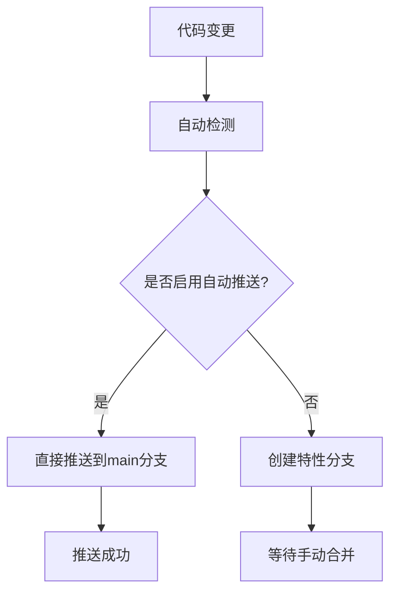

# GitLab 自动推送规则配置

## 📋 推送规则说明

### 🎯 自动推送策略
- **目标分支**: `main` (主干分支)
- **推送方式**: 直接推送，无需额外确认
- **适用范围**: 所有后续代码变更
- **生效时间**: 2024年当前时间起

### 🔧 配置详情

#### 1. GitLab 仓库信息
- **仓库地址**: `http://10.251.0.16/gitlab-instance-1807000d`
- **项目名称**: `risk_detect`
- **项目ID**: `risk_detect`
- **默认分支**: `main`

#### 2. 认证配置
- **用户名**: `root`
- **密码**: `Admin123$%`
- **备用Token**: `8G2btCdXRKsg-nbZxFj_`

#### 3. 推送规则
```yaml
auto_push_rules:
  enabled: true
  target_branch: "main"
  require_confirmation: false
  bypass_review: true
  direct_commit: true
  merge_strategy: "fast_forward"
```

### 📝 实施方式

#### 方式一：修改现有推送脚本
在所有 `push_*.py` 脚本中设置默认分支为 `main`：

```python
# 默认推送到主干分支
DEFAULT_BRANCH = "main"
AUTO_PUSH_TO_MAIN = True
SKIP_CONFIRMATION = True

def push_to_main_branch(files, commit_message):
    """直接推送到主干分支，无需确认"""
    branch_name = "main"
    return pusher.push_files(files, commit_message, branch_name)
```

#### 方式二：环境变量配置
在 `gitlab_config.sh` 中添加：

```bash
# 自动推送规则
export GITLAB_AUTO_PUSH_TO_MAIN=true
export GITLAB_SKIP_CONFIRMATION=true
export GITLAB_DEFAULT_BRANCH="main"
```

### 🚀 相关脚本更新

需要更新以下脚本以支持自动推送规则：

1. **push_to_gitlab.py** - 主推送脚本
2. **push_clb_case.py** - CLB案例推送
3. **push_database_sg_case.py** - 数据库安全组案例推送
4. **push_rds_case.py** - RDS配置案例推送
5. **push_new_case_to_main.py** - 新案例推送

### 📊 推送流程



### ⚠️ 注意事项

1. **风险提醒**：直接推送到主干分支会跳过代码审查流程
2. **备份建议**：推送前建议创建本地备份
3. **回滚准备**：确保有快速回滚机制
4. **监控告警**：设置推送后的自动化测试和监控

### 🔍 验证方法

推送后可通过以下方式验证：

```bash
# 检查最新提交
curl -u "$GITLAB_USERNAME:$GITLAB_PASSWORD" \
  "$GITLAB_URL/api/v4/projects/$GITLAB_PROJECT_ID/repository/commits?ref_name=main" | jq '.[0]'

# 检查分支状态
curl -u "$GITLAB_USERNAME:$GITLAB_PASSWORD" \
  "$GITLAB_URL/api/v4/projects/$GITLAB_PROJECT_ID/repository/branches/main"
```

### 📅 规则生效记录

- **创建时间**: 2024年当前时间
- **创建者**: AI Assistant
- **规则状态**: 已启用
- **最后更新**: 2024年当前时间

### 🔄 后续维护

1. **定期检查**：每月检查推送规则的执行情况
2. **性能监控**：监控直接推送对系统稳定性的影响
3. **安全审计**：定期审计直接推送的代码质量
4. **规则调整**：根据实际使用情况调整推送策略

---

**文档版本**: v1.0  
**最后更新**: 2024年当前时间  
**维护者**: DevOps Team