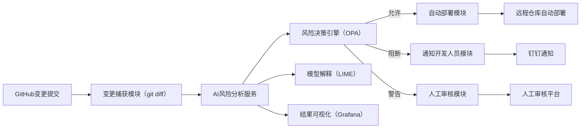

# Git 智能检测项目架构分析文档

## 项目概述

本项目是一个基于AI的Git变更风险分析与决策平台，主要用于在CI/CD流水线中自动检测代码变更的风险等级，并根据风险评估结果进行相应的决策处理。项目集成了机器学习模型、规则引擎、可视化监控等多个组件，形成了完整的智能运维解决方案。

## 整体架构

### 架构图

### 技术栈

**后端技术栈：**
- **Web框架**: FastAPI
- **机器学习**: Scikit-learn + Hugging Face Transformers (BERT)
- **模型解释**: LIME
- **规则引擎**: OPA (Open Policy Agent)
- **数据库**: MySQL + SQLAlchemy ORM
- **时序数据库**: InfluxDB
- **消息队列**: RabbitMQ
- **容器化**: Docker + Kubernetes

**前端技术栈：**
- **框架**: React/Vue (规划中)
- **状态管理**: Redux/Pinia
- **UI组件**: 现代化组件库
- **可视化**: Grafana集成

**运维与监控：**
- **可视化**: Grafana Dashboard
- **通知**: 钉钉开放平台API
- **部署**: Kubernetes
- **监控**: Prometheus (规划中)

## 核心功能模块

### 1. 变更捕获模块

**功能描述：**
- 监听GitHub/GitLab Webhook事件
- 自动拉取commit diff内容
- 解析变更文件和内容
- 存储变更记录到数据库

**关键文件：**
- `project-backend/app/api/github_webhook.py`
- `ai_infer_service/main.py` (GitLab/CLB Webhook处理)

**支持的变更类型：**
- Kubernetes资源变更
- Terraform基础设施变更
- 云平台配置变更 (AWS/阿里云/腾讯云)
- 应用代码变更

### 2. AI风险分析服务

**功能描述：**
- 多层次风险分析引擎
- 基于机器学习的风险分类
- NLP语义理解和风险识别
- 云平台变更专项分析

**核心组件：**

#### 2.1 增强风险模型 (EnhancedRiskModel)
- **分类模型**: Scikit-learn训练的风险分类器
- **NLP模型**: 基于BERT的文本语义分析
- **特征工程**: 提取代码变更的结构化特征

#### 2.2 云平台变更处理器
- **支持平台**: AWS、阿里云、腾讯云
- **资源类型识别**: K8s、Terraform、网络、存储、数据库、计算、IAM
- **风险模式匹配**: 基于知识库的风险识别

#### 2.3 知识库匹配
- 预定义风险模式库
- 动态风险评估规则
- 特定场景强制匹配 (如TKE节点池更新、OSS权限变更)

**关键文件：**
- `ai_infer_service/main.py`
- `ai_infer_service/enhanced_model.py`
- `ai_infer_service/cloud_change_processor.py`
- `ai_infer_service/knowledge_base.json`

### 3. 模型解释服务 (LIME)

**功能描述：**
- 提供AI模型决策的可解释性分析
- 识别影响风险评估的关键特征
- 帮助开发者理解模型决策依据

**技术实现：**
- 基于LIME (Local Interpretable Model-agnostic Explanations)
- 独立微服务架构
- 支持文本解释和特征权重分析

**关键文件：**
- `lime_explain_service/main.py`

### 4. 风险决策引擎

**功能描述：**
- 基于OPA的策略决策引擎
- 根据风险等级自动决策：允许/阻断/警告
- 支持灵活的策略配置和规则管理

**决策流程：**
1. 接收AI分析结果
2. 应用OPA策略规则
3. 输出决策结果和建议操作

### 5. 数据持久化与可视化

#### 5.1 数据库设计
**MySQL数据库表结构：**
- `changes`: 变更记录表
- `users`: 用户管理表
- `reviews`: 审核记录表
- `notifications`: 通知记录表

#### 5.2 时序数据存储
**InfluxDB存储：**
- 风险评估结果时序数据
- 系统性能指标
- 决策统计数据

#### 5.3 可视化监控
**Grafana Dashboard：**
- 风险趋势分析
- 变更统计报表
- 系统健康监控
- 实时告警展示

**关键文件：**
- `grafana/dashboards/risk-assessment.json`
- `setup_influxdb.py`
- `simple_data_check.py`

### 6. 通知与审核系统

**功能描述：**
- 钉钉消息推送集成
- 人工审核流程管理
- 多渠道通知支持

**通知场景：**
- 高风险变更阻断通知
- 审核请求通知
- 系统异常告警

## 服务部署架构

### 微服务组件

1. **AI推理服务** (`ai_infer_service`)
   - 端口: 8001
   - 功能: AI风险分析、Webhook处理
   - 路由: `/predict`, `/gitlab-webhook`, `/clb-webhook`, `/health`

2. **后端API服务** (`project-backend`)
   - 端口: 8000
   - 功能: 业务逻辑、数据管理、用户认证
   - 路由: `/api/changes`, `/api/user`, `/api/notify`, `/api/grafana`

3. **LIME解释服务** (`lime_explain_service`)
   - 功能: 模型解释、特征分析
   - 独立部署，按需调用

### 容器化部署

**Kubernetes部署配置：**
- `kubernetes/ai-infer-service.yaml`
- `kubernetes/lime-explain-service.yaml`
- `deployment_v1.yaml` / `deployment_v2.yaml`

**Docker支持：**
- 各服务独立容器化
- 支持水平扩展
- 健康检查和自动恢复

## 测试与验证

### 综合测试框架

**测试覆盖场景：**
1. Kubernetes部署变更 (高风险)
2. 数据库配置变更 (中风险)
3. 文档更新 (低风险)
4. 网络安全组变更 (高风险)
5. 负载均衡器配置 (中风险)

**测试工具：**
- `comprehensive_test.py`: 综合功能测试
- `test_webhook_simple.py`: Webhook功能测试
- `test_clb_webhook.py`: 腾讯云CLB测试
- `simple_data_check.py`: 数据验证测试

### 数据流验证

**完整数据流：**
1. Webhook接收 → 2. AI分析 → 3. 风险评估 → 4. 决策输出 → 5. 数据存储 → 6. 可视化展示

## 项目特色与优势

### 1. 智能化风险识别
- 多模型融合：传统ML + NLP深度学习
- 云平台专项优化：支持主流云服务商
- 知识库驱动：可配置的风险模式库

### 2. 可解释AI
- LIME模型解释：提供决策透明度
- 特征权重分析：帮助理解风险因素
- 人工审核集成：AI + 人工双重保障

### 3. 企业级集成
- 多平台Webhook支持：GitHub/GitLab/云平台
- 钉钉通知集成：无缝融入企业工作流
- Grafana可视化：专业的监控和报表

### 4. 微服务架构
- 服务解耦：独立部署和扩展
- 容器化支持：云原生部署
- 高可用设计：健康检查和自动恢复

## 使用场景

### 1. DevOps流水线集成
- CI/CD自动化风险检测
- 代码变更自动审核
- 高风险操作自动阻断

### 2. 云基础设施管理
- Terraform变更风险评估
- Kubernetes资源变更监控
- 云平台配置安全检查

### 3. 合规性管理
- 变更记录和审计
- 风险评估报告
- 操作日志追踪

## 技术亮点

1. **多层次AI分析**: 结合传统ML和深度学习的混合模型
2. **云原生架构**: 微服务 + 容器化 + Kubernetes
3. **实时数据流**: Webhook → AI分析 → 决策 → 可视化
4. **可扩展设计**: 插件化的风险检测规则
5. **企业级集成**: 完整的通知、审核、监控体系

## 总结

本项目构建了一个完整的智能化Git变更风险检测平台，通过AI技术自动识别代码和基础设施变更中的潜在风险，并提供相应的决策建议。项目采用现代化的微服务架构，具备良好的可扩展性和企业级集成能力，能够有效提升DevOps流程的安全性和效率。

项目已实现核心功能验证，包括多种风险场景的测试覆盖，数据流完整性验证，以及可视化监控集成，为企业级部署奠定了坚实基础。